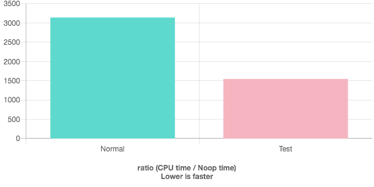
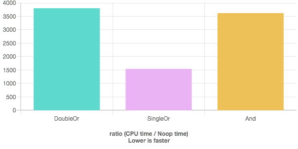

Dec 8, 2019

# Description

Matt Godbolt gave an interesting example of how conditional branches can be optimized by using `if( a | b )` in place of `if( a || b )`:
https://www.youtube.com/watch?v=HG6c4Kwbv4I (skip to final 15 minutes)

I thought I would play around with a simple example here.

# Test

In quick-bench.com:

```c++
#include <algorithm>    // std::shuffle
#include <array>
#include <random>       // std::default_random_engine

using num_array = std::array< float, 1000 >;

num_array generate(){
  num_array n;
  for( uint i = 0; i < 1000; ++i ){
    n[i] = float(i) / 1000.0;
  }
  shuffle (n.begin(), n.end(), std::default_random_engine(123));
  return n;
}

int number_of_values_in_window( num_array const & arr ){
  int count = 0;
  for( float f : arr ){
    if( f < 0.45 || f > 0.55 ) continue; //global range is 0-1
    ++count;
  }
  return count;
}

int number_of_values_in_window2( num_array const & arr ){
  int count = 0;
  for( float f : arr ){
    if( f < 0.45 | f > 0.55 ) continue; //global range is 0-1
    ++count;
  }
  return count;
}

static void Normal(benchmark::State& state) {
  auto n = generate();
  // Code inside this loop is measured repeatedly
  for (auto _ : state) {
    auto count = number_of_values_in_window( n );
    benchmark::DoNotOptimize( count );
  }
}
// Register the function as a benchmark
BENCHMARK(Normal);

static void Test(benchmark::State& state) {
  auto n = generate();
  // Code inside this loop is measured repeatedly
  for (auto _ : state) {
    auto count = number_of_values_in_window2( n );
    benchmark::DoNotOptimize( count );
  }
}
// Register the function as a benchmark
BENCHMARK(Test);
```

# Results

Most modern compilers gave equal runtimes for each one.
However, I was able to find conditions that gave a factor of 2 speedup!



Using `gcc-6.4, c++11, -O3`

# Why

In Matt's talk that I linked earlier, his conclusion was that the double-`||` option
confused the CPU's branch predictor. Booleans/conditions `a` and `b` are individually unlikely
but `a || b` is overwhelmingly likely.
When obfuscated by more advanced logic, the compiler might consider `a` and `b` as different branches, such as:
```c++
for( float f : arr ){
  if( f < 0.45 ) continue; // unlikely
  if( f > 0.55 ) continue; // unlikely (Though it would be likely given the results of the first branch. That's one thing I didn't fully understand from Matt's talk)
  ++count;
}
```

Based on the assembly (https://godbolt.org/z/mJJu5v),
I think my case is too simple to trip up the branch-predictor like that.
Instead, it looks like the single-`|` option is simply more vectorizable than the double-`||` option.

# Summary

Most compilers gave equal benchmark times.
Between this test and Matt's test (https://www.youtube.com/watch?v=HG6c4Kwbv4I, skip to final 15 minutes),
single-`|` is rarely better than double-`||` but it is significantly better when it is.

### Appendix A

Most people would probably write their code more like this:
```c++
inline
int number_of_values_in_window3( num_array const & arr ){
  int count = 0;
  for( float f : arr ){
    if( f >= 0.45 && f <= 0.55 ) ++count;
  }
  return count;
}
```

I threw that into the mix as the "And" test and it was equivalent to "Normal" (renamed "DoubleOr"):

