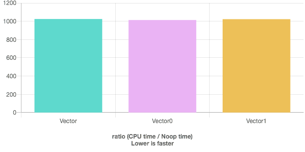
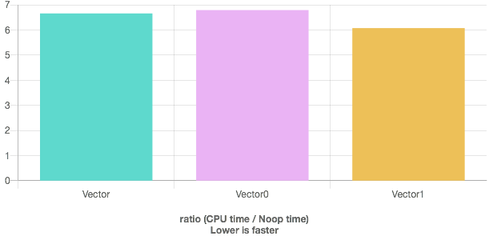

Nov 22, 2019

# Description

Rosetta uses 1-indexing for its vector class
(`utility::vectorL< 1 >`, aliased as `utility::vector1`).
We are told in bootcamp that this is only a compile-time slowdown and not a runtime slowdown.
I took that with a grain of salt, because surely there must be _some_ slowdown with this implementation:

```c++
T &
operator []( index_type const i )
{
	return super::operator []( i - L ); //size_t L = 1, is offset
}
```

I thought I would be clever and implement a new vector1 type that does not need to do a subtraction for every element lookup:

## Plan

Let's say a normal, 0-indexed vector's data looks like this:
```c++
template< typename T >
class vector {
  void * ptr_to_beginning_of_allocation;
  void * ptr_to_end_of_allocation;
  
  void * ptr_to_end_of_vector;
  // ptr_to_end_of_vector >= ptr_to_beginning_of_allocation
  // ptr_to_end_of_vector <= ptr_to_end_of_allocation
  
  T &
  operator []( index_type const i ) {
    return ptr_to_beginning_of_allocation + ( i * sizeof(T) );
    //Would need to do additional subtration here for 1-indexing
  }
  
  size_t
  size(){
    // the reverse is equally valid, where the class stores the size and calculates the ptr_to_end_of_vector on the fly
    // Whichever one you choose doesn't matter for this test
    return ( ptr_to_end_of_vector - ptr_to_beginning_of_allocation ) / sizeof( T );
  }
};
```

I thought it would be clever to offset the `ptr_to_beginning_of_allocation` _backwards_ by the base index.
So if the allocated data started at `0xffff`,
`ptr_to_beginning_of_allocation` would be equal to `0xffff - ( sizeof( T ) * L )` (where L is the base index).
Note that this would leave the base index of 0 completely unchanged.

This way, you would not need to constantly subtract the index by `L` for every lookup.
The slowdown instead appears when reallocating, which is often a worthwhile tradeoff.

## Results

I really liked by plan because it made 1-indexing
(which Rosetta uses even though I'm not a fan)
theoretically as cheap as 0-indexing.

Before implementing this, I wanted to benchmark the status quo.
Below I show results of accessing `std::vector`, `vectorL< 0 >`, and `vectorL< 1 >`.
It turns out that `vectorL< 1 >` is as-fast or faster than `std::vector` accross every compiler/c++-version I tested.

Since my plan had a theoretical access speed identical to `std::vector`,
I did not bother implementing it after seeing these results.

See below for a description of the tests.
These plots are from quick-bench.com using `gcc-8.1` and `c++14`
but other compilers and c++ versions matched these results.





## Test Setup

There's a lot of code that precedes the tests, which I dumped here: https://godbolt.org/z/_mpFQg

**Note:** You may have to delete the occasional `debug_assert` or `utility_exit_with_message`.

# Test 1

This first benchmark tests the random access speed of shuffled indices.

```c++
#include <algorithm>
#include <random>

static void Vector(benchmark::State& state) {
  std::vector<int> * v = new std::vector<int>( 1000 );
  std::array< uint, 1000 > values;
  for( int i = 0; i < 1000; ++i ){
    values[ i ] = i;
  }
  shuffle (values.begin(), values.end(), std::default_random_engine(0));

  // Code inside this loop is measured repeatedly
  for (auto _ : state) {  
    for( uint i : values ){
      int j = (*v)[ i ];
      // Make sure the variable is not optimized away by compiler
      benchmark::DoNotOptimize(j);
    }
  }
}
// Register the function as a benchmark
BENCHMARK(Vector);

static void Vector0(benchmark::State& state) {
  utility::vectorL< 0, int, std::allocator<int> > * v0 = new utility::vectorL< 0, int, std::allocator<int> >( 1000 );
  std::array< uint, 1000 > values;
  for( int i = 0; i < 1000; ++i ){
    values[ i ] = i;
  }
  shuffle (values.begin(), values.end(), std::default_random_engine(0));

  // Code inside this loop is measured repeatedly
  for (auto _ : state) {
    // Make sure the variable is not optimized away by compiler
    for( uint i : values ){
      int j = (*v0)[ i ];
      benchmark::DoNotOptimize(j);
    }
  }
}
BENCHMARK(Vector0);

static void Vector1(benchmark::State& state) {
  utility::vectorL< 1, int, std::allocator<int> > * v1 = new utility::vectorL< 1, int, std::allocator<int> >( 1000 );
  std::array< uint, 1000 > values;
  for( int i = 1; i <= 1000; ++i ){
    values[ i - 1 ] = i;
  }
  shuffle (values.begin(), values.end(), std::default_random_engine(0));

  // Code inside this loop is measured repeatedly
  for (auto _ : state) {
    int j = ++(*v1)[ values[10] ];
    benchmark::DoNotOptimize(j);
  }
}
// Register the function as a benchmark
BENCHMARK( Vector1 );
```


# Test 2

This test is a more concise. Just read and increment a value at a position that is not known at compile time.

```c++
#include <algorithm>
#include <random>

static void Vector(benchmark::State& state) {
  std::vector<int> * v = new std::vector<int>( 1000 );
  std::array< uint, 1000 > values;
  for( int i = 0; i < 1000; ++i ){
    values[ i ] = i;
  }
  shuffle (values.begin(), values.end(), std::default_random_engine(0));

  for (auto _ : state) {
    int j = ++(*v)[ values[10] ];
    benchmark::DoNotOptimize(j);
  }
}
BENCHMARK(Vector);

static void Vector0(benchmark::State& state) {
  utility::vectorL< 0, int, std::allocator<int> > * v0 = new utility::vectorL< 0, int, std::allocator<int> >( 1000 );
  std::array< uint, 1000 > values;
  for( int i = 0; i < 1000; ++i ){
    values[ i ] = i;
  }
  shuffle (values.begin(), values.end(), std::default_random_engine(0));

  for (auto _ : state) {
    int j = ++(*v0)[ values[10] ];
    benchmark::DoNotOptimize(j);
  }
}
BENCHMARK(Vector0);

static void Vector1(benchmark::State& state) {
  utility::vectorL< 1, int, std::allocator<int> > * v1 = new utility::vectorL< 1, int, std::allocator<int> >( 1000 );
  std::array< uint, 1000 > values;
  for( int i = 1; i <= 1000; ++i ){
    values[ i - 1 ] = i;
  }
  shuffle (values.begin(), values.end(), std::default_random_engine(0));

  for (auto _ : state) {
    int j = ++(*v1)[ values[10] ];
    benchmark::DoNotOptimize(j);
  }
}
BENCHMARK( Vector1 );

```


